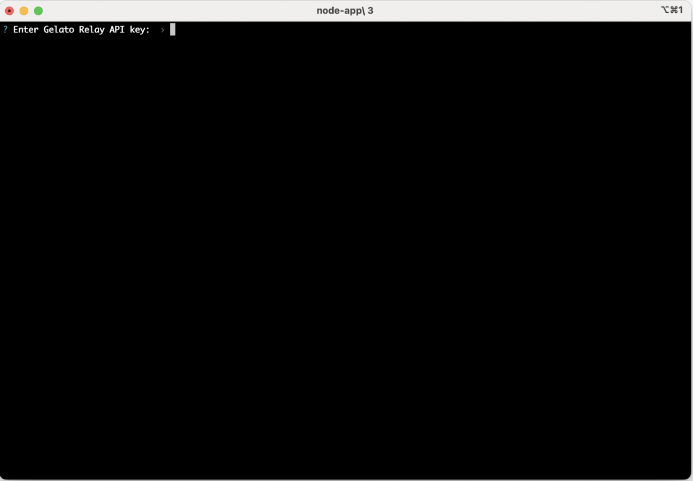

# Arbitrum Blueberry Verifier Node

## Table of Contents

1. [Installation](#installation)
2. [Setting up](#setting-up)
   - [Interactive CLI](#interactive-cli)
   - [Environment variables](#environment-variables)
   - [Required env variables](#required-env-variables)
     - [Option 1](#option-1)
     - [Option 2](#option-2)
   - [Optional env variables](#optional-env-variables)
3. [Running on local machine](#running-on-local-machine)
4. [Running on cloud server](#running-on-cloud-server)
5. [Smart Contracts](#smart-contracts)
   - [Minting Node Key](#minting-node-key)
   - [Delegate rights to attest](#delegate-rights-to-attest)

## Installation

1. Download 1 of the following zip files depending on your machine.

- `verifier-linux.zip`
- `verifier-macos.zip`
- `verifier-win.zip`

2. Unzip the file and you will get a folder containing the verifier node application.

- `verifier-linux/verifier-node-app-linux`
- `verifier-macos/verifier-node-app-macos`
- `verifier-win/verifier-node-app-win.exe`

## Setting up

### Interactive CLI


Settings can be passed via the interactive cli just by launching the application.

If you prefer not to enter the settings each time you launch the application, refer to [environment variables](#environment-variables).

### Environment variables

Create a `.env` file in the folder (e.g. `/verifier-macos`) containing the node application and fill up with the necessary variables.

```
OPERATOR_PK=
RELAY_API_KEY=

# Set either one
#------------1-------------
NODE_KEY_IDS= # [1,2,3]
#------------2-------------
AUTO_KEY_IDS=true
WALLETS=[]
# [] (Use all fetched node key ids delegated to operator) or
# ["0x...","0x..."] (Use fetched node key ids that are delegated to operator and owned by defined wallets.)
#-------------------------

# Optionals
DEBUG=
INTERVAL= # In ms (Must be > 60000)
L1_RPC_URL=
# Your personal RPC url of settlement chain (Arbitrum Sepolia RPC)
# Setting `L1_RPC_URL` is highly recommended for better reliability and performance.
```

### Required env variables

- `OPERATOR_PK`: Operator private key which will use to sign the attestation.
- `RELAY_API_KEY`: [Gelato Relay](https://app.gelato.network/relay) API key.

#### Option 1

Manually define a list of node key IDs that have delegated to the operator.

- `NODE_KEY_IDS`: A list of node key ids.

#### Option 2

Automatically fetch all node key IDs that have delegated to the operator.

**Important:** It is highly recommended to set and maintain a list of `WALLETS` that you want to attest for. Without specifying this list, you will end up attesting for all delegations to your operator, which may not be desirable.

- `AUTO_KEY_IDS`: Automatically fetch node keys if true.
- `WALLETS`: Only attest for fetched node key ids that are owned by defined wallets.

### Optional env variables

- `DEBUG`: Debug mode.
- `INTERVAL`: Interval between runs.
- `L1_RPC_URL`: Your personal RPC URL of the settlement chain. (Arbitrum Sepolia RPC)

**Note:** Setting `L1_RPC_URL` is highly recommended for better reliability and performance.

## Running on local machine

After setting up the environment variable, open the app to run the verifier node.

## Running on cloud server

The verifier node is also available as a docker image [`gelatodigital/blueberry-verifier:latest`](https://hub.docker.com/r/gelatodigital/blueberry-verifier).

On GCP for example,

- Create a cloud run job pulling the `gelatodigital/blueberry-verifier` image.
- Set up the env variables.
- Add a scheduler trigger to execute the container every hour.

# Smart Contracts

| Smart Contract   | Address                                       |
| ---------------- | --------------------------------------------- |
| MockNodeKey      | `0xf4D4a4f8B3F4799E7206511F1A2E112cB2329687`  |
| MockRewardToken  | `0x0A1A96262498c707563859abC71ACA2ec38107FB1` |
| NodeRewards      | `0xac89576FD6D45F244343827c18b3Cc0AA013bC35`  |
| Referee          | `0xC7767767121Ec2cB831EF299b9F6db201cEAac8a`  |
| DelegateRegistry | `0x00000000000000447e69651d841bD8D104Bed493`  |

### Minting Node Key

### [`MockNodeKey.mint`](https://arb-blueberry.gelatoscout.com/address/0xf4D4a4f8B3F4799E7206511F1A2E112cB2329687?tab=write_proxy)

- `_to`: Address to mint to.
- `_amount`: Number of NFT to mint.

### Delegate rights to attest

### [`DelegateRegistry.delegateERC721`](https://arb-blueberry.gelatoscout.com/address/0x00000000000000447e69651d841bD8D104Bed493?tab=write_contract)

- `to`: Operator address.
- `contract_`: `0xf4D4a4f8B3F4799E7206511F1A2E112cB2329687` (MockNodeKey address).
- `tokenId`: ID of node key NFT.
- `rights`: `0x0000000000000000000000000000000000000000000000000000000000000000`
- `enable`: true
- `Send native CGT`: `0`
